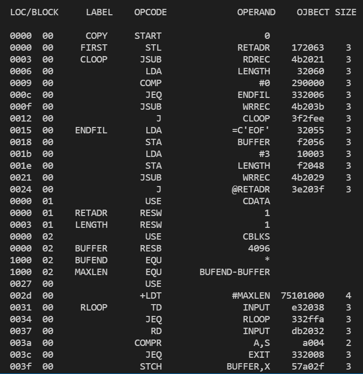

# Multi-Pass SIC/XE Assembler
A very basic sic/xe assembler created for CMPE 220 Project

build:
```
g++ -I. -o output  main.cpp assembler\assembler.cpp assembler\structs.cpp utils\utils.cpp
```
run:
```
./output
```

  

---
**Todos:**
- [x] Handle 4 instruction formats
- [x] Handle all addressing modes
- [ ] Add Makefile
- [x] Generate object code for BYTE & WORD directive
- [ ] Perform Error Detections
- [ ] Generate Object File
- [x] Literals
- [x] Expression
- [x] Symbol-defined Statements
- [x] Program Block
- [ ] Control Section
